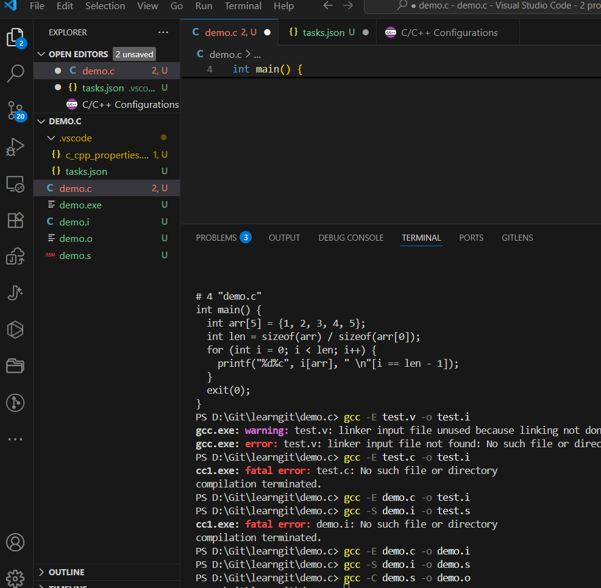
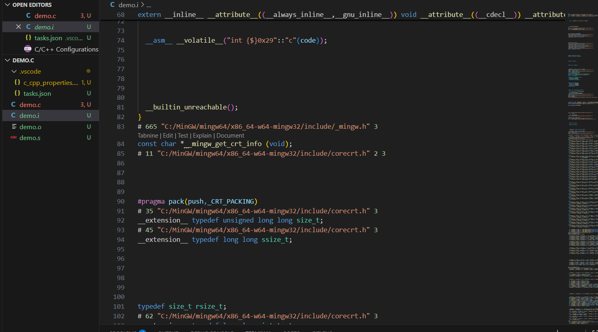
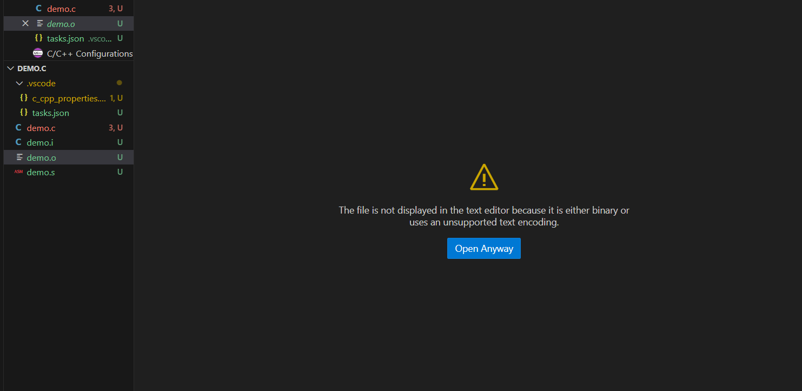
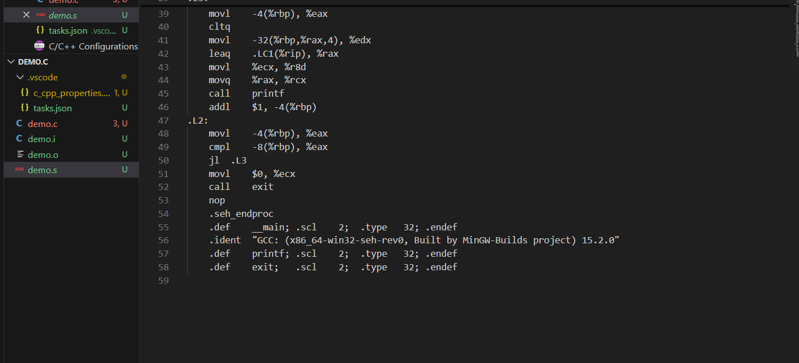

### 1.c源代码到可执行文件的完整流程
##### 预处理Preprocessing -> 编译Compilation -> 汇编Assembling -> 链接Linking
---
##### #预处理
由预处理器完成，主要将#开头指令进行处理，输出扩展后.i文件

- 展开 #include ：将头文件（如 stdio.h ）的内容直接插入到当前代码中
​
- 替换 #define ：将宏定义的常量/表达式替换到代码中（如 #define i 3 会把所有 i 换成 3 ）
​
- 处理条件编译：根据 #if / #ifdef / #else 等指令，保留符合条件的代码，删除不符合的部分
​
- 删除注释：将 // 或 /*...*/ 包裹的注释全部删除，避免干扰后续编译  
​`gcc -E hello.c    ->   hello.i`
---
##### #编译
编译由编译器完成，将预处理后的 .i 文件转化为汇编语言代码，输出 .s 文件。
​
- 语法/语义分析：检查代码是否符合C语言语法规则（如括号不匹配、变量未定义），若有错误直接报错（如“undefined reference to  printf ”）
​
- 优化代码：对代码进行逻辑优化（如删除冗余计算）、性能优化（如循环展开），提升最终程序的运行效率
​
- 生成汇编代码：将优化后的C代码，翻译成对应CPU架构的汇编指令（如 mov / add / call 等）  
​
  `gcc -S test.i -> test.s `
  
---

##### #汇编
汇编由汇编器完成，将 .s 文件的汇编指令转化为CPU可识别的二进制机器码，输出 .o 

- 指令映射：将每条汇编指令对应到CPU的二进制 opcode（如 0x01 d8 ）
​
- 生成符号表：记录目标文件中的变量、函数名称及其对应的内存地址（此时地址为“相对地址”，尚未确定最终位置）  
​
  ` gcc -c test.s -o test.o` 
---

##### #链接
链接由链接器完成，将多个 .o 目标文件（若代码依赖其他文件）和系统库文件（如 libc.so ）整合，最终生成可执行文件
 
- 合并目标文件：将多个 .o 文件的机器码、数据段合并到同一个内存空间。
​
- 解析符号引用：解决“外部依赖”，比如代码中调用的 printf 函数，会从系统的C标准库（ libc ）中找到其实际机器码并链接进来。
​
- 分配最终地址：给所有变量、函数分配程序运行时的“绝对内存地址”，确保指令能正确找到数据和函数。  
​
  `gcc test.o -o test` 

---

### 2.每一步运行过程

好的我们打开了这个GitHub库，通过download zip我们成功下载了这个task

跟随我们自己的笔记，在终端分别输入预处理、编译、汇编、链接的指令，可以看到分别生成了.i、.s、.o、.exe的文件

*请忽略我输错了n次指令的愚蠢*

*ok也是完成了*

