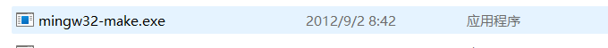
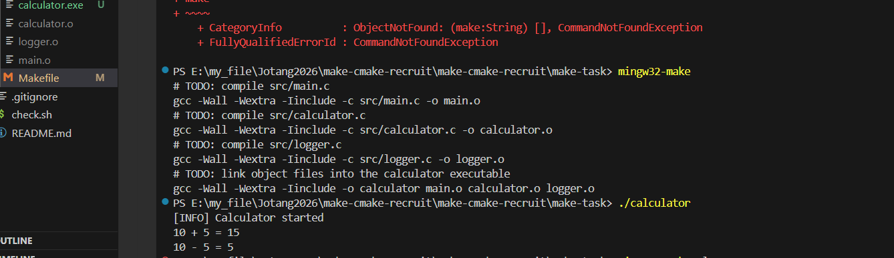
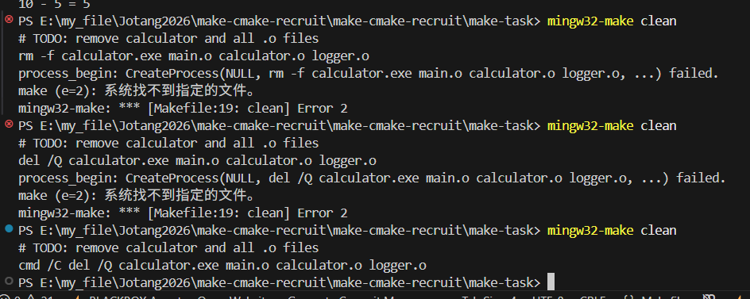
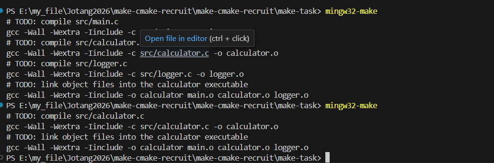
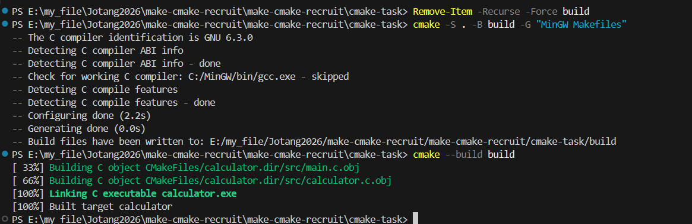
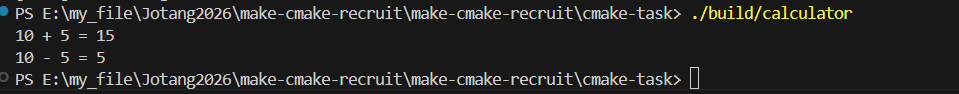
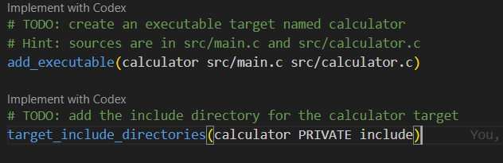

## task1
见answer中的task1

---

## task2

我最开始使用make报错

*才发现原来我的make是mingw32-make*

这个makefile就是把`.c`文件转化为`.o`文件并link生成`.exe`文件
`-c`代表只编译，`-o`用来指定编译或链接后输出的文件名
clean就是删除生成的文件

可以正常运行

删除的时候我才真的是一直报错，说找不到
**最后发现del是window内部cmd的指令要指定一下**

如果我们运行make后只更改一下calculator.c的时间戳再重新make
那就只会重新编译它自己

已经编译过且没有改变的.c文件就需不要重新编译了，**增量编译**节省时间空间（按时间戳来）

---

## task3

先下载cmake然后配置环境变量
*最开始一直报错，是因为没有指定cmake使用mingw来编译，所以加上了"MinGW Makefiles"来指定*

成功运行了就

关于cmakelists

> add_executable(...) —— 告诉CMake要生成什么程序：第一个是生成文件名，后面的是生成这个文件所需源文件
> target_include_directories(...) —— 告诉编译器去哪里找头文件：
> `target_include_directories(calculator PRIVATE include)`中`calculator`定这个包含路径是给哪个目标用的，`PRIVATE`意思是这个头文件路径只给calculator自己用，`include`就是存放头文件的那个文件夹名字